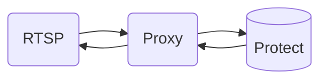
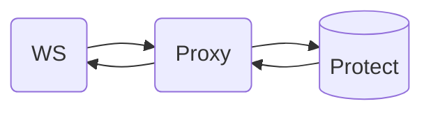
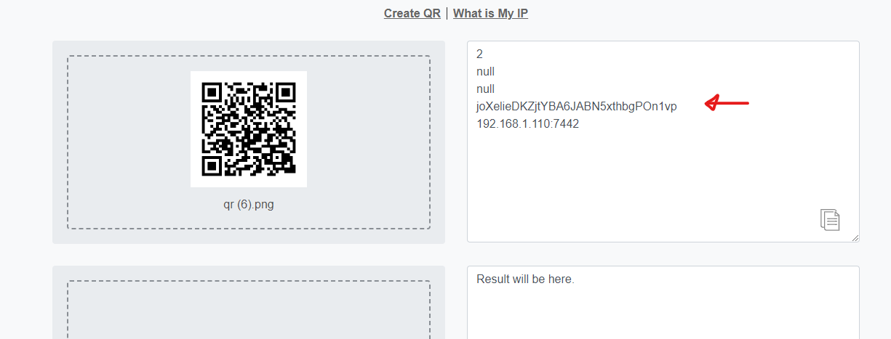
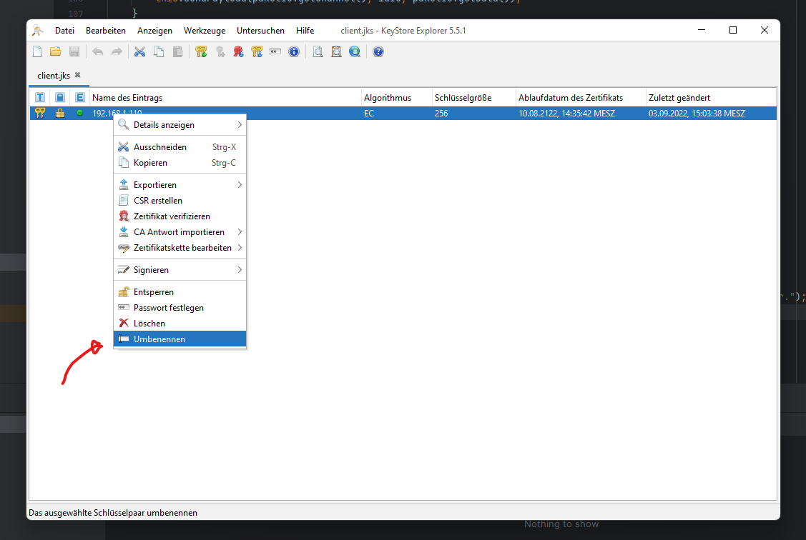

# UniFi Proxy

### How it works as a diagram

#### Protect (Cam)
Connection between Camera and Proxy are RTSP or a custom Cam Provider.



#### Protect (Smart Device)
Connection between Smart Device (Light...) and Proxy are WS or a custom Smart Device Provider.




UniFi Proxy makes it possible to integrate third-party hardware into UniFi Protect.

For testing purposes only, it is recommended to purchase hardware directly from the manufacturer and not to tamper with
the system.

### Generate new Adoption Token

To adopt a device in UniFi Protect it is necessary to generate a token for it. This **token is only valid for 60
minutes** and is deleted even after a service restart.

1. Login into your local UniFi Controller (not unifi.ui.com).
2. Open following URL ``https://unifi/proxy/protect/api/cameras/qr`` which shows an QR Code, if your Browser can't parse
   the DHCP Name you need to replace ``unifi`` with the Controllers IPv4 Address.
3. Decode the QR Code with a [Decoder for QR Codes](https://qrcode-decoder.com/).
4. Copy the Adoption Token out of the QR Code Payload.



### Generate a new KeyStore

For **Communication with the Secure (HTTP/S, WSS) Protocol** you need to create your own Certificate.
Because **Java can't read the raw PEM Files** you need to import your Keypair into a Java KeyStore (JKS).

Since there were some problems with the Keytool CLI in the past, we use the KeyStore Explorer tool for this.

1. Download the [Java Key Store Explorer](http://keystore-explorer.org/downloads.html).
2. Create a new KeyStore File:


3. Generate new Client Certificate:

```
mkdir tmp
openssl ecparam -out ./tmp/private.key -name prime256v1 -genkey -noout
openssl req -new -sha256 -key ./tmp/private.key -out ./tmp/server.csr -subj "/C=TW/L=Taipei/O=Ubiquiti Networks Inc./OU=devint/CN=camera.ubnt.dev/emailAddress=support@ubnt.com"
openssl x509 -req -sha256 -days 36500 -in ./tmp/server.csr -signkey ./tmp/private.key -out ./tmp/public.key
cat ./tmp/private.key ./tmp/public.key > ./tmp/client.pem
```

4. Import your Certificate into KeyStore as OpenSSL Keypair.


5. Select your Public and Private Key and untick the Password Checkbox.


6. Rename the Imported Keypair to your UniFi Controller Host.



### Adopting to Protect

If a device does not appear immediately, **it may be that too many adoption requests have been sent**. In most cases, this can be fixed by restarting the Protect Service.


### Adding Recognition Templates

**Experimental Feature (Hard CPU Usage)**

Visit the Official GitHub Repository of OpenCV an look for predefined Templates
under [opencv/data/haarcascades](https://github.com/opencv/opencv/tree/master/data/haarcascades).

### Debug your Controller

To access your device you need to enable SSH on your Controller, sometimes you need to login as root to view all Directory's.

- To find UniFi Protect Config: ``find / -name config.json``

- To find UniFi Protect Logs: ``find / -name logs``

#### For example, we want to debug the ``camera.avclient`` Log.

In the current Controller Firmware Version we can use following Command: ``tail -f /srv/unifi-protect/logs/cameras.avclient.log``

### Find your Camera

I used following Tool to identify my Camera and the Stream Information: