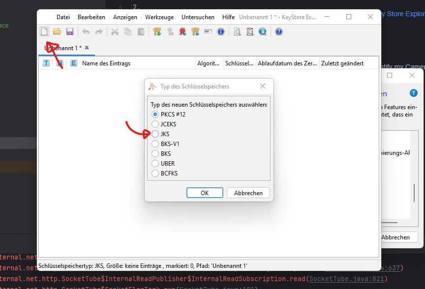
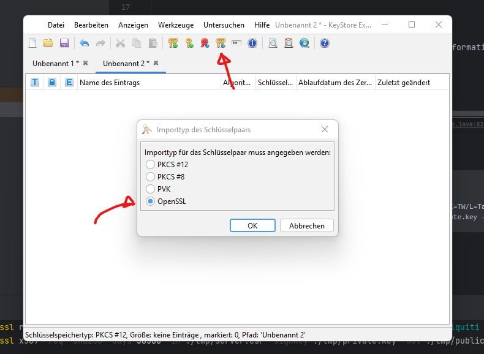
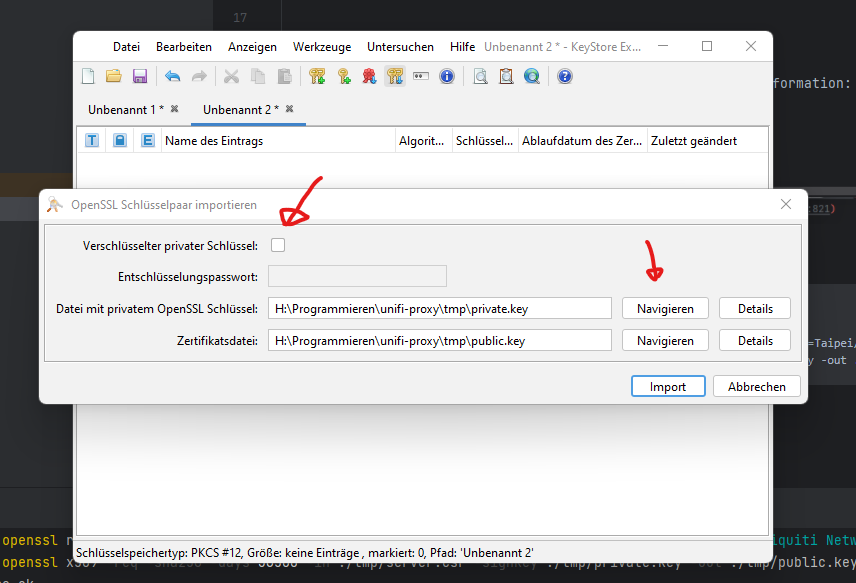

### Generate a new KeyStore

For Communication you need to create your own KeyStore.

1. Download the [Java Key Store Explorer](http://keystore-explorer.org/downloads.html).
2. Create a new KeyStore File:



3. Generate new Client Certificate:
```
mkdir tmp
openssl ecparam -out ./tmp/private.key -name prime256v1 -genkey -noout
openssl req -new -sha256 -key ./tmp/private.key -out ./tmp/server.csr -subj "/C=TW/L=Taipei/O=Ubiquiti Networks Inc./OU=devint/CN=camera.ubnt.dev/emailAddress=support@ubnt.com"
openssl x509 -req -sha256 -days 36500 -in ./tmp/server.csr -signkey ./tmp/private.key -out ./tmp/public.key
cat ./tmp/private.key ./tmp/public.key > ./tmp/client.pem
```
4. Import your Certificate into KeyStore as OpenSSL Keypair.



5. Select your Public and Private Key and untick the Password Checkbox.



### Find your Camera

I used following Tool to identify my Camera and the Stream Information: